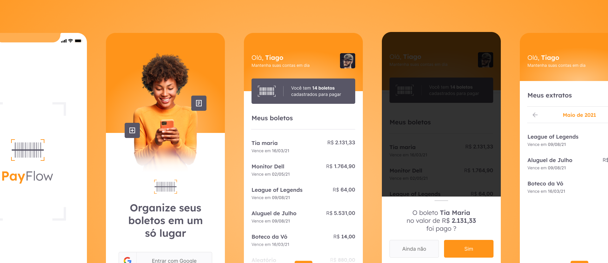

  

<h2>Sobre 📖</h2> 
   

   O PayFlow se trata de um app mobile feito em Flutter para Gerenciamento de Boletos, contendo recursos como o uso de câmera e galeria, Machine Leaning com MLKit, Firebase Core e SignIn, Animações e Estilizações Personalizadas, entre vários outros pontos, como o uso do SharedPreferences.  

   Com o Flutter você pode utilizar está aplicação no <strong>Telemóvel, Web e Desktop</strong>.

---

<h2>Layout 🎨</h2> 

   

      
   

   
 
   - <a href="https://www.figma.com/file/ZrNubXWjRWADC4t8ZSgLH9/PayFlow-(Community)?node-id=0%3A1">Para visualiza o UI Mobile</a> 📱
   

   
   
